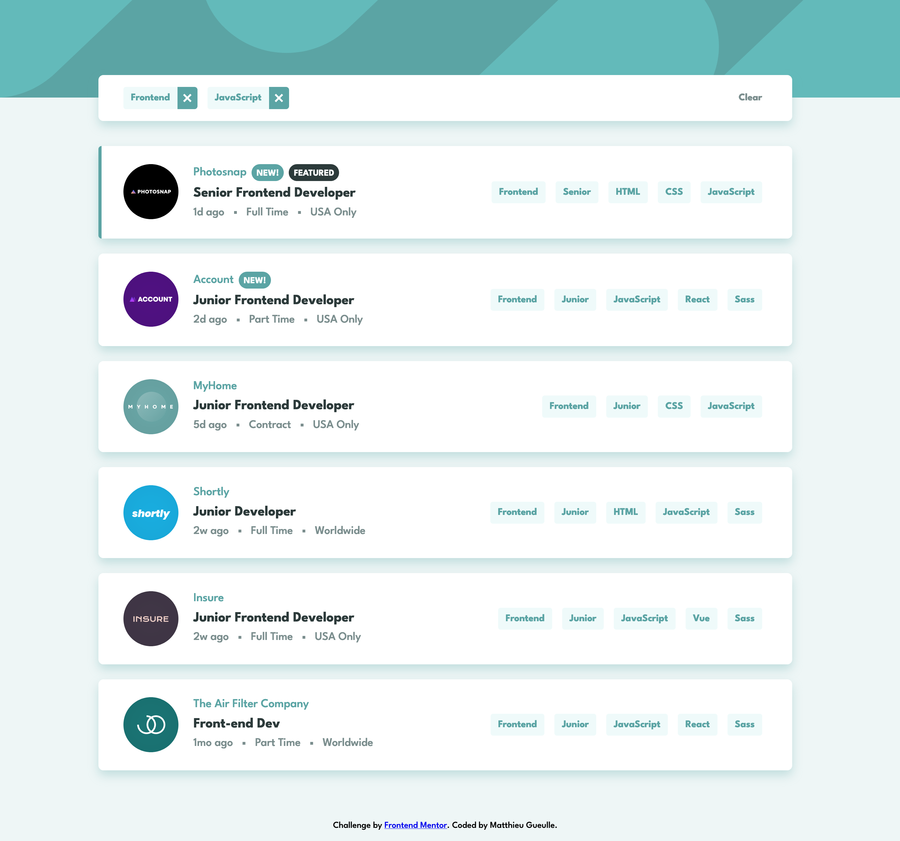
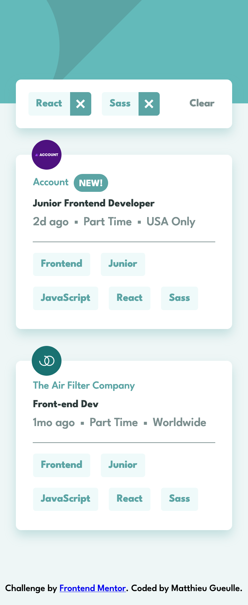

# Job Listing page solution

Cet application web est ma version du challenge [Job Listing page de Frontend Mentor](https://www.frontendmentor.io/challenges/job-listings-with-filtering-ivstIPCt)

## Le challenge

L'utilisateur doit pouvoir :

-   Consulter la page de manière optimale, quelque soit le device utilisé
-   Observer des animations au survol de tous les éléments intéractifs de la page
-   Filtrer les résultats en cliquant sur les tags présent dans les annonces
-   Supprimer un ou plusieurs filtres en cliquant dessus dans le bandeau de filtres
-   Réinitialiser tous les filtres en cliquant sur "Clear"

## Screenshots

Aperçu de la version desktop

Aperçu de la version mobile

## Le process

### Technos

-   CSS Vanilla
-   Flexbox
-   Responsive Layout
-   Librairies JS
    -   [React](https://reactjs.org/)
    -   [Redux-Toolkit](https://redux-toolkit.js.org/)
    -   [React Redux](https://react-redux.js.org/)
    -   [UUID](https://github.com/uuidjs/uuid#readme)

### Ce que cela m'a apporté

-   Améliorer ma reflexion en terme de composants React et leur logique de fonctionnement
-   Un entraînement à l'utilisation de Redux Toolkit, qui facilite grandement l'accès aux données dans toute l'application
-   Utilisation de fonctions CSS comme clamp() et usage de variables, afin de réduire le nombre de lignes de CSS pour le responsive et les répétitions
-   Travail du comportement responsif des élements. Maintenir un visuel, une taille et une lisibilité accrue, quelque soit la dimension de l'écran

### Ressources

-   [MDN](https://developer.mozilla.org/fr/) - Ma ressource première pour HTML, CSS et JavaScript
-   [Formation React](https://www.udemy.com/course/react-formation-complete/) par [Enzo Ustariz](https://www.youtube.com/@EcoleduWeb).
-   [Introduction à Redux Toolkit](https://youtu.be/1lvnT2oE0_4) par [Lior Chamla](https://www.youtube.com/@LiorCHAMLA)

## Author

-   [Matthieu Gueulle](www.linkedin.com/in/matthieu-gueulle) - LinkedIn